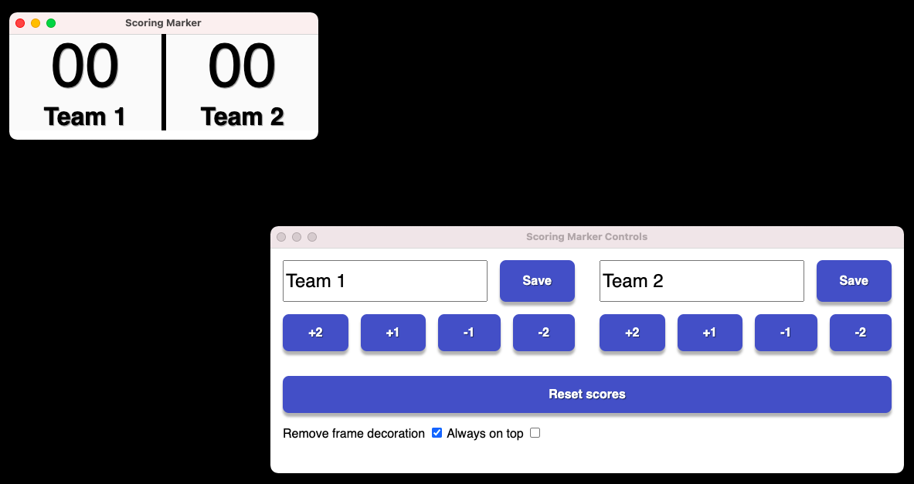

# Scoring Marker

## Description



Display two scores and control the points from another window.
Ideal for a dual screen display or integration into a video with [OBS Studio](https://obsproject.com/).

## Download

[Downloads for all operating systems](https://github.com/Sylvaner/scoring-marker/releases)

## Features

* Manage the scores of 2 teams
* Remove the menu bar from the scores window
* Force the score window above the others

## Development

Language: Javascript
Framework : [Electron](https://www.electronjs.org/)

### Launch

```bash
git clone https://github.com/Sylvaner/scoring-marker
cd scoring-marker
npm install
npm run start
```

### Building the executable

```bash
npm run build
```

### Customize the rendering of scores

For the structure, modify the HTML file __scoring.html__. Nodes with the IDs team-score0, team-score1, team-name0, and team-name1 must exist to work.

For the visual, edit the CSS file __scoring.css__.

## Contact

https://www.sdangin.fr

---

# Compteur de points

## Description


Afficher un score et contrôler les points à partir d'une autre fenêtre.
Idéal pour un affichage en double écran ou pour une intégration dans une vidéo avec [OBS Studio](https://obsproject.com/) par exemple.

## Téléchargements

[Téléchargements pour toutes les systèmes d'exploitation](https://github.com/Sylvaner/scoring-marker/releases)

## Fonctionnalités

* Gérer les scores de 2 équipes
* Enlever la barre de menu de la fenêtre des scores
* Forcer la fenêtre de scores au dessus des autres

## Développement

Langage : Javascript
Framework : [Electron](https://www.electronjs.org/)

### Lancement

```bash
git clone https://github.com/Sylvaner/scoring-marker
cd scoring-marker
npm install
npm run start
```

### Construction de l'exécutable

```bash
npm run build
```

### Personnaliser le rendu des scores

Pour la structure, modifier le fichier HTML __scoring.html__. Des noeuds avec les ID team-score0, team-score1, team-name0 et team-name1 doivent exister pour pouvoir fonctionner.

Pour le visuel, modifier le fichier CSS __scoring.css__.

## Contact

https://www.sdangin.fr